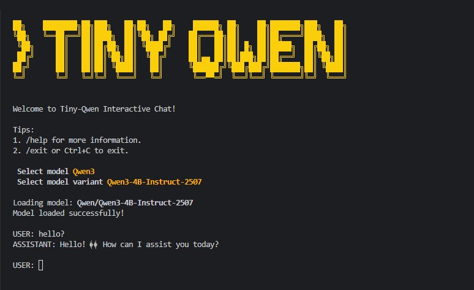

<p align="left">
    中文 | <a href="README.md">English</a>
</p>

<p align="center">
    
</p>

# ✨ Tiny Qwen

一个简洁易读的 PyTorch 代码库，用于重新实现 `Qwen3` 和 `Qwen2.5-VL`，支持纯文本和图像模态，以及稠密和混合专家架构。

如果你觉得 Hugging Face 代码过于冗长难懂，这个库正适合你！

欢迎大家加我的 [Discord 群](https://discord.gg/sBNnqP9gaY)继续讨论！

## 🦋 快速开始

推荐使用 `uv` 创建虚拟环境：

```bash
pip install uv && uv venv

# 激活环境
source .venv/bin/activate # Linux/macOS
.venv\Scripts\activate # Windows

# 安装依赖
uv pip install -r requirements.txt
```

启动交互式对话：

```bash
python run.py
```

**注意：** `Qwen3` 仅支持文本。使用 `@path/to/image.jpg` 为 `Qwen2.5-VL` 引用图片。

```
USER: @data/test-img-1.jpg 告诉我这张图片里有什么？
✓ Found image: data/test-img-1.jpg
ASSISTANT: 这张图片展示了充满活力的向日葵田...
```

## 📝 代码示例

**运行 `Qwen2.5-VL`：**

```python
from PIL import Image
from model.model import Qwen2VL
from model.processor import Processor

model_name = "Qwen/Qwen2.5-VL-3B-Instruct"
model = Qwen2VL.from_pretrained(repo_id=model_name, device_map="auto")
processor = Processor(repo_id=model_name, vision_config=model.config.vision_config)

context = [
    "<|im_start|>user\n<|vision_start|>",
    Image.open("data/test-img-1.jpg"),
    "<|vision_end|>这张图片里有什么？<|im_end|>\n<|im_start|>assistant\n",
]

inputs = processor(context, device="cuda")

generator = model.generate(
    input_ids=inputs["input_ids"],
    pixels=inputs["pixels"],
    d_image=inputs["d_image"],
    max_new_tokens=64,
    stream=True,
)

for token_id in generator:
    token_text = processor.tokenizer.decode([token_id])
    print(token_text, end="", flush=True)
print()
```

**运行 `Qwen3`：**

```python
from model.model import Qwen3MoE
from model.processor import Processor

model_name = "Qwen/Qwen3-4B-Instruct-2507"
model = Qwen3MoE.from_pretrained(repo_id=model_name)
processor = Processor(repo_id=model_name)

context = [
    "<|im_start|>user\n<|vision_start|>",
    "<|vision_end|>解释一下反转链表<|im_end|>\n<|im_start|>assistant\n",
]
inputs = processor(context, device="cuda")
generator = model.generate(
    input_ids=inputs["input_ids"],
    max_new_tokens=64,
    stream=True
)

for token_id in generator:
    token_text = processor.tokenizer.decode([token_id])
    print(token_text, end="", flush=True)
print()
```
